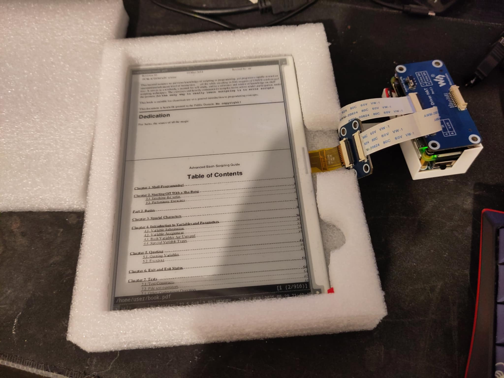
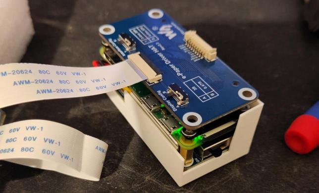
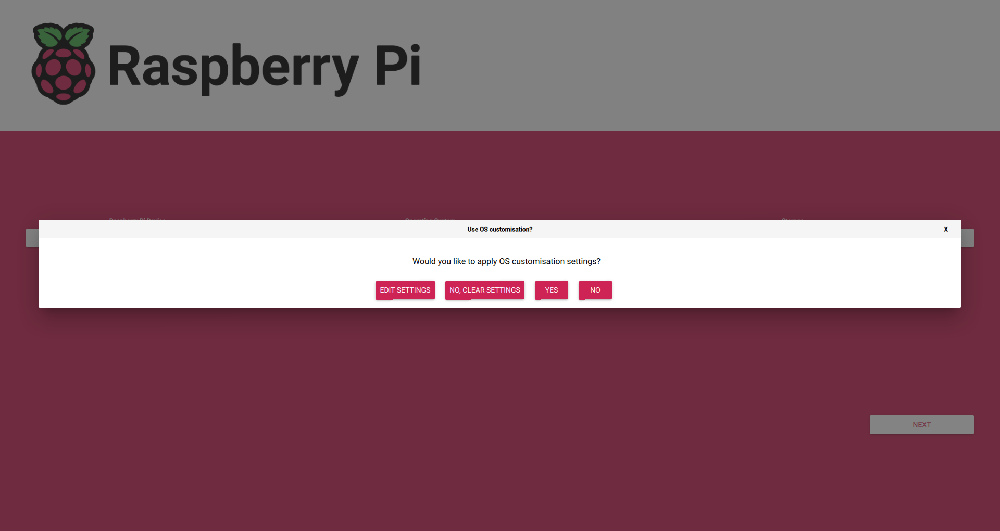
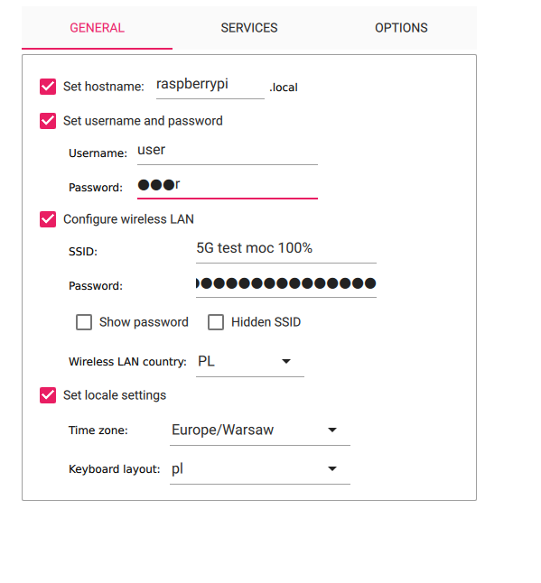
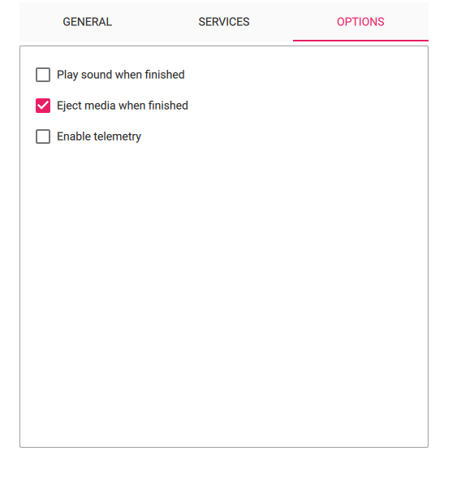
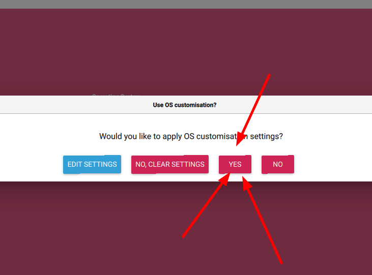
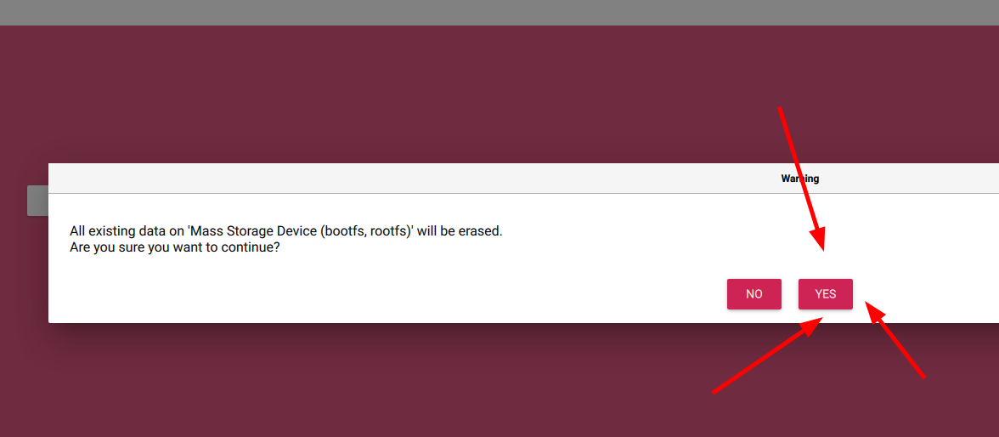
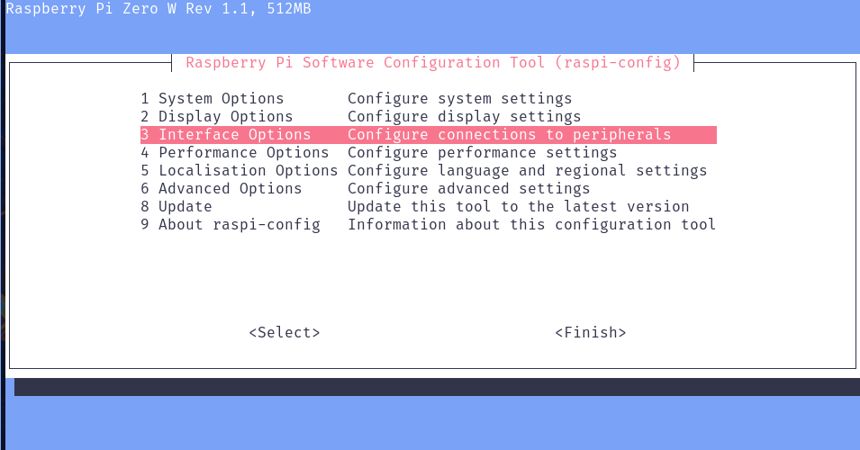
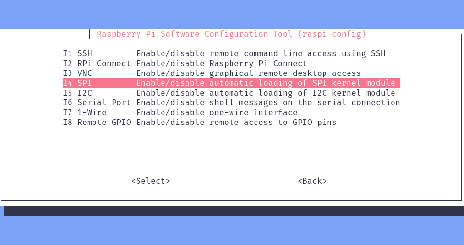
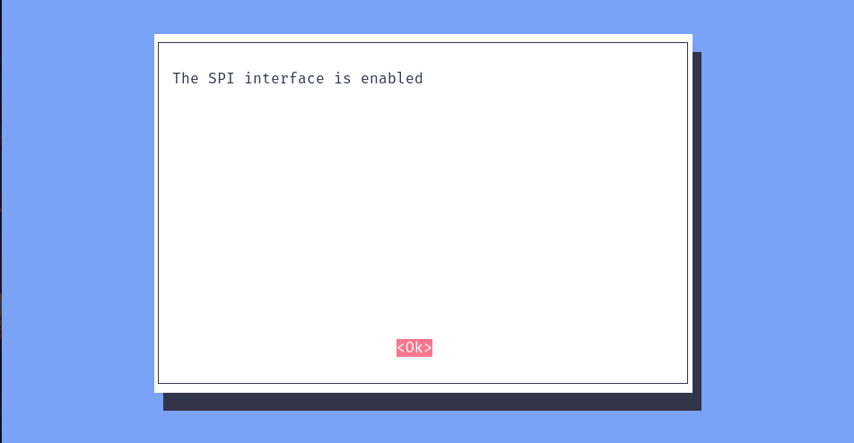

# Raspberry Pi Zero E-Ink ebook reader

## About project
This project was created in haste in under two weeks. I didn’t even have time to put the project on GitHub before. \
The project itself exists because of two things:
1. The supervisor of my student research group asked me to build something cool for the student research groups seminar,
and I think kitbashing an ebook reader in just two weeks definitely counts as “something cool.”
2. I bought my first ever e-ink device and I love E-Ink technology, but the reader I bought was garbage, 
so I decided I could make a better one. Currently, it’s not perfect, but at least it’s something I can improve.

## Hardware
### Raspberry Pi Zero
- **Compact size** – The smallest Raspberry Pi capable of running a full-fledged OS (half the size of the Raspberry Pi 4)
- **All-in-one** – GPIO header, WiFi, Bluetooth, HDMI, Micro USB ports, full-featured Linux
- **Price** – 80 PLN for a microcomputer that can run a complete operating system (3–4 times cheaper than Raspberry Pi 4)
- **Support** – Access to Debian packages and official Raspberry drivers/libraries

### E-paper E-Ink 7.5'' 800x480px Black/White by Waveshare
- **Size**: 7.5 inches  
- **Resolution**: 800×480 px  
- **Interface**: SPI  
- **Power supply**: 3.3V / 5V  
- **Type**: Passive reflective (no backlight)  
- **Refresh time**: Full refresh – 5s, partial refresh – 0.3s  

### UPS HAT – Backup Power Supply for Raspberry Pi Zero

- **Simultaneous charging and powering** (5V output)
- **I2C monitoring** of voltage, current, power, and battery status
- **Battery protection** against overcharge, deep discharge, overload, and short circuit
- **Easy connection** using pogo spring pins, compatible with other HATs

### OpenSCAD Case Design
I created a simple case (in OpenSCAD) to limit battery movement: 



## Flashing image 








## Connecting to Raspberry Pi with ssh
### Finding the Raspberry Pi's Address Using Nmap
The address where the Raspberry Pi appears after booting  
should be visible in your router's control panel.
But if that's not possible, or you'd like to do it differently,  
you can use the **Nmap** scanner for this task.
#### Step 1: Check Your Own IP Address
Use the following command:
```bash
ip a
```
You should see something like this:
```bash
inet 192.168.1.101/24 brd 192.168.1.255 scope global dynamic noprefixroute enp7s0
```
Here, `192.168.1.101` is your own IP address.
#### Step 2: Scan the Subnet with Nmap
We’ll scan all hosts in the `192.168.1.0/24` subnet.
- `-p 22` — scan port 22 (SSH)  
- `-sV` — detect service versions (sometimes includes hostname in banner)
```bash
nmap -p 22 -sV 192.168.1.101/24
```
#### Step 3: Identify the Raspberry Pi
Look for a device that identifies itself as Raspbian:
```text
Nmap scan report for 192.168.1.102
Host is up (0.045s latency).

PORT   STATE SERVICE VERSION
22/tcp open  ssh     OpenSSH 9.2p1 Raspbian 2+deb12u5 (protocol 2.0)
Service Info: OS: Linux; CPE: cpe:/o:linux:linux_kernel
```
### First Login
Login to the Raspberry Pi over SSH:

```bash
ssh user@192.168.1.102
```
#### Package Updates
Update package list:
```bash
sudo apt update
```
Install required packages:
```bash
sudo apt install neovim python3-pip python3-pil python3-numpy python3-gpiozero git xvfb x11-utils \
imagemagick x11-apps xserver-xephyr xserver-xorg-video-dummy xserver-xorg-input-libinput i3 zathura -y
```
Remove unnecessary packages:
```bash
sudo apt remove nano -y
```
## Enabling SPI

To change Raspberry Pi settings, use the dedicated **menuconfig** tool provided by Raspberry Pi:
```bash
sudo raspi-config
```
### Enabling SPI – Step 1

### Enabling SPI – Step 1

### Enabling SPI – Step 1

### Enabling SPI – Step 1


Reboot the system:
```bash
sudo reboot
```
Wait a moment and log in again:
```bash
ssh user@192.168.1.102
```
Check if SPI is working:
```bash
ls /dev/spidev0.*
```
If you see something like this, SPI is enabled:
```bash
/dev/spidev0.0  /dev/spidev0.1
```
## Testing the Example and Library
Clone the library:
```bash
git clone https://github.com/waveshare/e-Paper
```
Navigate to the examples directory:
```bash
cd e-Paper/RaspberryPi_JetsonNano/python/examples
```
We have the 7.5 V2 display, so grant execution permissions to the appropriate script:
```bash
chmod +x epd_7in5_V2_test.py
```
Run the example:
```bash
sudo ./epd_7in5_V2_test.py
```
The screen should flicker a few times and display some test images.

## Creating Your Own Renderer
### Key Dependencies
- **Xorg**  
  This is a popular display server for Linux responsible for the graphical environment (window display, mouse and keyboard handling).  
  In our project, we run `Xorg` with a dummy configuration — a "virtual" screen without a physical monitor.
- **i3**  
  This is a tiling window manager (divides the screen into tiles), lightweight and configurable.  
  We use it to manage windows in the Xorg session, allowing us to run applications like `zathura`.
- **Zathura**  
  A minimalist PDF viewer that works well with i3.  
  In our script, it is used to open a PDF file on the virtual screen, which is then visible on the e-paper display.
### What is `dummy` in Xorg?
- **Dummy driver** is a virtual display driver for Xorg.  
- It allows running the X server without a physical monitor connected to the Raspberry Pi.  
- Enables rendering graphics in memory and access to the display (DISPLAY=:0).  
- Useful in headless systems, e.g., for e-paper handling where no physical screen is needed.
### Xorg Configuration with Dummy Driver
Create the configuration directory and file:
```bash
sudo mkdir -p /etc/X11/xorg.conf.d
sudo nvim /etc/X11/xorg.conf.d/10-dummy.conf
```
And add the following configuration: [10-dummy.conf](10-dummy.conf)

## Creating Renderer:
Create a new file:
```bash
nvim /home/user/e-Paper/RaspberryPi_JetsonNano/python/examples/renderer.py
```
## Renderer - Running
Let's quickly go back to your computer and transfer the book:
```bash
scp advanced_bash_shell_guide.pdf user@192.168.1.102:~/book.pdf
```
Check if our code runs on the Raspberry Pi:
```bash
cd /home/user/e-Paper/RaspberryPi_JetsonNano/python/examples
sudo ./renderer.py
```
The book located at /home/user/book.pdf should appear on the display.

## Creating Your Own systemd Daemon
We have a working e-ink book renderer.
Ideally, it should start automatically when the system boots.
### What is a systemd daemon?
- **systemd** is a modern init system and service manager for Linux systems.
- It is responsible for starting, stopping, and monitoring system services (daemons).
- A systemd daemon runs continuously in the background, managing processes and system resources.
- It allows defining services via unit files that control their behavior.
- Provides fast system startup and automatic service restarts in case of failures.
## Creating a systemd Service 
Create a new file:
```bash
sudo nvim /etc/systemd/system/renderer.service
```
and add following content [renderer.service](renderer.service)
### Starting the systemd daemon
After saving the service file:
```bash
sudo systemctl daemon-reexec
sudo systemctl enable renderer.service
sudo systemctl start renderer.service
```
Checking the status:
```bash
sudo systemctl status renderer.service
```
Checking Logs:
```bash
journalctl -u renderer.service
```
### Creating a systemd Service - Code Explanation
## \[Unit\] Section
- `Description` – service description shown during service management.  
- `After` – defines startup order; this service starts after:  
  - `multi-user.target` (multi-user mode),  
  - `network-online.target` (network is online),  
  - `ssh.service` (SSH server is running).  
- `Wants` – indicates a desire to start `network-online.target` but it's not critical.
## \[Service\] Section
- `Type=simple` – service runs as a single process (default).  
- `ExecStart` – command to start the service, here our Python script.  
- `Restart=always` – automatically restart the service if it stops.  
- `RestartSec=10` – wait 10 seconds before restarting.  
- `Environment` – sets environment variables:  
  - `DISPLAY=:0` – points to X server display.  
  - `HOME=/root` – home directory (important for permissions).  
  - `XDG_RUNTIME_DIR=/run/user/0` – runtime directory for root user.
## \[Install\] Section
- `WantedBy=multi-user.target` – specifies the service should start automatically in multi-user mode (standard system runlevel).  
- Allows the service to start on boot after running `systemctl enable renderer.service`.
